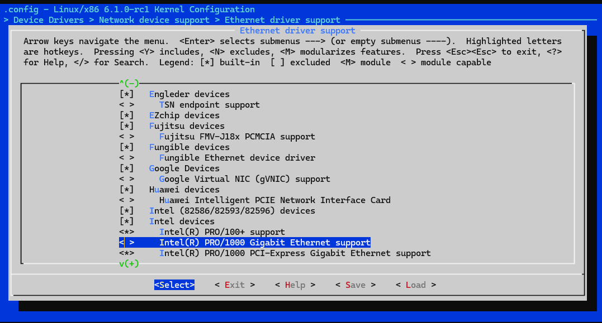
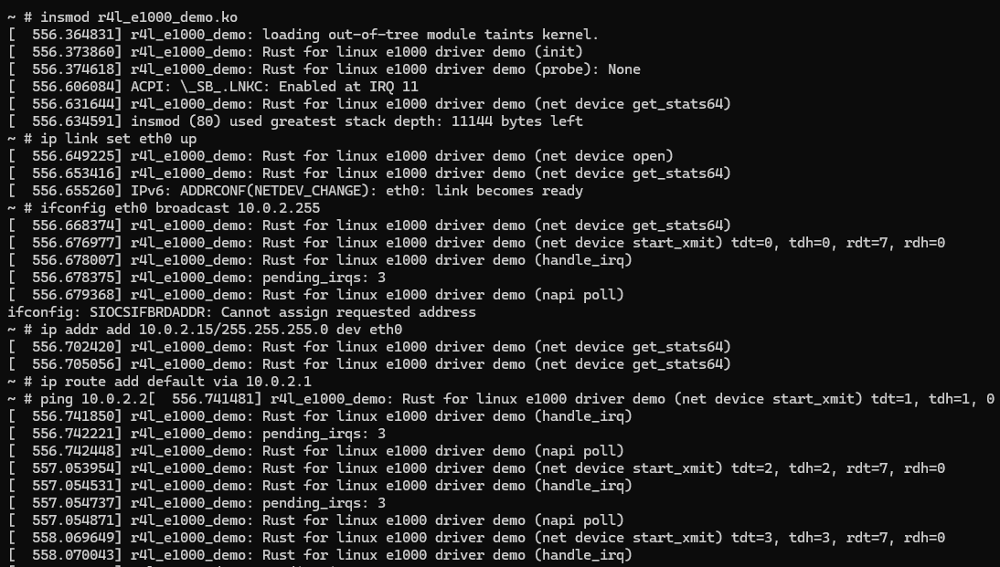

# Assign 1： Build and Compile Linux Kernel
We use WSL2 with Ubuntu 22.04 to conduct all the assignment

## Step 1: Install required dependecies
```bash
sudo apt install git curl
sudo apt install build-essential libtool texinfo gzip zip unzip patchutils cmake ninja-build automake bison flex gperf grep sed gawk bc zlib1g-dev libexpat1-dev libmpc-dev libncurses-dev libglib2.0-dev libfdt-dev libpixman-1-dev libelf-dev libssl-dev
sudo apt-get install clang-format clang-tidy clang-tools clang clangd libc++-dev libc++1 libc++abi-dev libc++abi1 libclang-dev libclang1 liblldb-dev libllvm-ocaml-dev libomp-dev libomp5 lld lldb llvm python3-clang
```

## Step 2: Install Rust

```bash
curl --proto '=https' --tlsv1.2 -sSf https://sh.rustup.rs | sh
```

## Step 3: Build Busybox

```bash
cd ./busybox-1.36.1/
make menuconfig
# Set the following config to yes
# General setup
#         ---> [*] Rust support
make install -j$(nproc)
```


## Step 4: Install QEMU
QEMU will be used in later Assignments

```bash
apt install qemu-system-x86
qemu-system-x86_64 --version
```

## Step 5: Config Linux files

```bash
cd ../linux
# 将此目录中的rustc重置为特定版本
# 可提前为rustup设置代理，以便加速下载过程，参考上一节“安装Rust”中的说明
rustup override set $(scripts/min-tool-version.sh rustc)
# 添加rust-src源代码
rustup component add rust-src
# 安装clang llvm，该项一般在配置内核时已经安装，若已安装此处可忽略
apt install clang llvm

# 可为cargo仓库crates.io设置使用镜像，参考上一节“安装Rust”中的说明
# 安装bindgen工具，注意在0.60版本后，bindgen工具的命令行版本位于bindgen-cli包中
cargo install --locked --version $(scripts/min-tool-version.sh bindgen) bindgen
# 安装rustfmt和clippy
rustup component add rustfmt
rustup component add clippy
# 检查内核rust支持已经启用
make LLVM=1 rustavailable
```
## Step 6: Compile Linux kernel with Rust

```bash
cd linux/
make x86_64_defconfig
make LLVM=1 menuconfig
# Set the following config to yes
# General setup
#         ---> [*] Rust support
make LLVM=1 -j$(nproc)
```


When succeed, you will see file `vmlinux` in the `linux/` folder.


# Assign 2: Config Linux Network Driver with Rust
We use WSL2 with Ubuntu 22.04 to conduct all the assignment

## Questions & Answers

###  在该文件夹中调用make LLVM=1，该文件夹内的代码将编译成一个内核模块。请结合你学到的知识，回答以下两个问题：

Q1、编译成内核模块，是在哪个文件中以哪条语句定义的？
A1：In the file `Kbuild`, the code `obj-m := r4l_e1000_demo.o` defined it.

Q2、该模块位于独立的文件夹内，却能编译成Linux内核模块，这叫做out-of-tree module，请分析它是如何与内核代码产生联系的？
A2: In the `Makefile`, `KDIR ?= ../linux; $(MAKE) -C $(KDIR) M=$$PWD` commands will change to the directory of the kernel and point out the module by `M'$$PWD`.

## Step 1: Build Linux Bootable Image

```bash
cd src_e1000
bash build_image.sh
```

## Step 2: Turn Off the e1000 Network Driver
Back to `linux/` and re-run make LLVM=1 menuconfig, then:
```
Device Drivers --->
    [*] Network device support --->
        [*] Ethernet driver support --->
            <> Intel devices, Intel(R) PRO/1000 Gigabit Ethernet support
```


## Step 3: Modify Network Configuration

After recompile the kernal code and entering the QEMU virtual machine, conduct following commands:

```bash
insmod r4l_e1000_demo.ko
ip link set eth0 up
ifconfig eth0 broadcast 10.0.2.255
ip addr add 10.0.2.15/255.255.255.0 dev eth0 
ip route add default via 10.0.2.1
ping 10.0.2.2
```

The output of commands shows below:


## Step 4: Exit QEMU
Press `Ctrl-A X` to exit the QEMU.


# Assign 3: Add Module to Linux with Rust
We use WSL2 with Ubuntu 22.04 to conduct all the assignment

## Step 1: Write Module Code
Create a file in `linux/samples/rust/` folder, named `rust_helloworld.rs`:
```rust
// SPDX-License-Identifier: GPL-2.0
//! Rust minimal sample.
      
use kernel::prelude::*;
      
module! {
  type: RustHelloWorld,
  name: "rust_helloworld",
  author: "whocare",
  description: "hello world module in rust",
  license: "GPL",
}
      
struct RustHelloWorld {}
      
impl kernel::Module for RustHelloWorld {
  fn init(_name: &'static CStr, _module: &'static ThisModule) -> Result<Self> {
      pr_info!("Hello World from Rust module\n");
      Ok(RustHelloWorld {})
  }
}

```


## Step 2: Modify Makefile and Kconfig
In `linux/sample/rust/Makefile`, add codes below:
```bash
obj-$(CONFIG_SAMPLE_RUST_HELLOWORLD)	+= rust_helloworld.o
```

In `linux/sample/rust/Kconfig`, add codes below:
```bash
config SAMPLE_RUST_HELLOWORLD
	tristate "Print Helloworld in Rust"
	help
	  This option builds the Rust module samples.

	  To compile this as a module, choose M here:
	  the module will be called rust_helloworld.

	  If unsure, say N.
```

## Step 3: Configure and Re-build the Kernel
Modify the configuration:
```
Kernel hacking
 [*] Sample kernel code  ---> 
     [*]   Rust samples  --->  
         <M>   HelloWorld 
```


## Step 4: Move Module to Target Folder
run follwoing code:
```bash
# Inside linux/ folder
mv ./samples/rust/rust_helloworld.ko ../src_e1000/rootfs
```

## Step 5: Run the Module
```bash
cd ../src_e1000
bash build_image.sh
```
Inside the QEMU:
```bash
insmod rust_helloworld.ko
dmesg | tail
```


