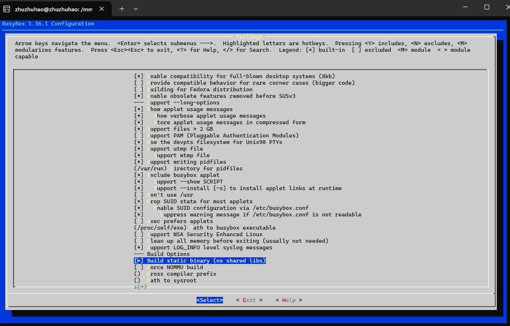
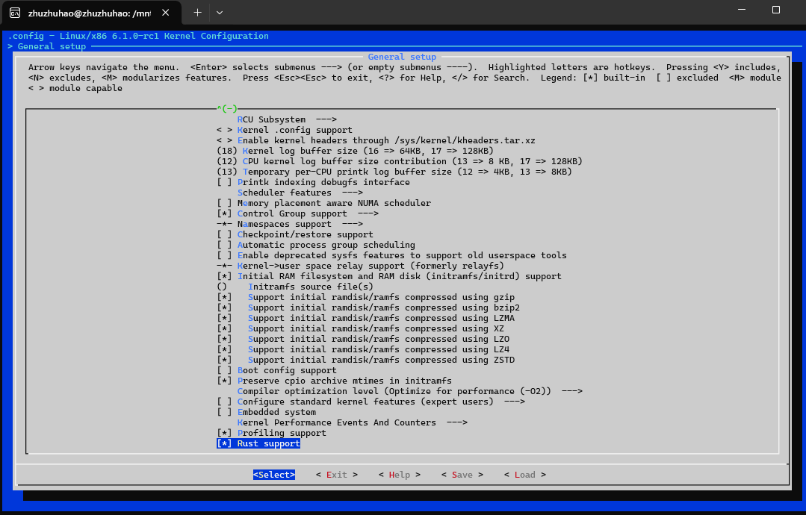

# Assign 1: Build and Compile Linux Kernel
We use WSL2 with Ubuntu 22.04 to conduct all the assignment

## Step 1: Install required dependecies
```bash
sudo apt install git curl
sudo apt install build-essential libtool texinfo gzip zip unzip patchutils cmake ninja-build automake bison flex gperf grep sed gawk bc zlib1g-dev libexpat1-dev libmpc-dev libncurses-dev libglib2.0-dev libfdt-dev libpixman-1-dev libelf-dev libssl-dev
sudo apt-get install clang-format clang-tidy clang-tools clang clangd libc++-dev libc++1 libc++abi-dev libc++abi1 libclang-dev libclang1 liblldb-dev libllvm-ocaml-dev libomp-dev libomp5 lld lldb llvm python3-clang
```

## Step 2: Install Rust

```bash
curl --proto '=https' --tlsv1.2 -sSf https://sh.rustup.rs | sh
```

## Step 3: Build Busybox

```bash
cd ./busybox-1.36.1/
make menuconfig
# Set the following config to yes
# General setup
#         ---> [*] Rust support
make install -j$(nproc)
```


## Step 4: Install QEMU
QEMU will be used in later Assignments

```bash
apt install qemu-system-x86
qemu-system-x86_64 --version
```

## Step 5: Config Linux files

```bash
cd ../linux
# 将此目录中的rustc重置为特定版本
# 可提前为rustup设置代理，以便加速下载过程，参考上一节“安装Rust”中的说明
rustup override set $(scripts/min-tool-version.sh rustc)
# 添加rust-src源代码
rustup component add rust-src
# 安装clang llvm，该项一般在配置内核时已经安装，若已安装此处可忽略
apt install clang llvm

# 可为cargo仓库crates.io设置使用镜像，参考上一节“安装Rust”中的说明
# 安装bindgen工具，注意在0.60版本后，bindgen工具的命令行版本位于bindgen-cli包中
cargo install --locked --version $(scripts/min-tool-version.sh bindgen) bindgen
# 安装rustfmt和clippy
rustup component add rustfmt
rustup component add clippy
# 检查内核rust支持已经启用
make LLVM=1 rustavailable
```
## Step 6: Compile Linux kernel with Rust

```bash
cd linux/
make x86_64_defconfig
make LLVM=1 menuconfig
# Set the following config to yes
# General setup
#         ---> [*] Rust support
make LLVM=1 -j$(nproc)
```


When succeed, you will see file `vmlinux` in the `linux/` folder.


# Assign 2: Config Linux Network Driver with Rust
We use WSL2 with Ubuntu 22.04 to conduct all the assignment

## Questions & Answers

###  在该文件夹中调用make LLVM=1，该文件夹内的代码将编译成一个内核模块。请结合你学到的知识，回答以下两个问题：

Q1、编译成内核模块，是在哪个文件中以哪条语句定义的？
A1：In the file `Kbuild`, the code `obj-m := r4l_e1000_demo.o` defined it.

Q2、该模块位于独立的文件夹内，却能编译成Linux内核模块，这叫做out-of-tree module，请分析它是如何与内核代码产生联系的？
A2: In the `Makefile`, `KDIR ?= ../linux; $(MAKE) -C $(KDIR) M=$$PWD` commands will change to the directory of the kernel and point out the module by `M'$$PWD`.

## Step 1: Build Linux Bootable Image

```bash
cd src_e1000
bash build_image.sh
```

## Step 2: Modify Network Configuration

After entering the QEMU virtual machine, conduct following commands:

```bash
insmod r4l_e1000_demo.ko
ip link set eth0 up
ip addr add broadcast 10.0.2.255 dev eth0
ip addr add 10.0.2.15/255.255.255.0 dev eth0 
ip route add default via 10.0.2.1
ping 10.0.2.2
```

The output of some commands shows below:
```
~ # insmod r4l_e1000_demo.ko
[  210.873311] r4l_e1000_demo: loading out-of-tree module taints kernel.
[  210.882634] r4l_e1000_demo: Rust for linux e1000 driver demo (init)
[  210.885130] insmod (79) used greatest stack depth: 13024 bytes left
~ # ip link set eth0 up
ip: RTNETLINK answers: Invalid argument
~ # ip addr add 10.0.2.15/255.255.255.0 dev eth0
ip: RTNETLINK answers: File exists
~ # ip route add default via 10.0.2.1
ip: RTNETLINK answers: File exists
~ # ping 10.0.2.2
PING 10.0.2.2 (10.0.2.2): 56 data bytes
64 bytes from 10.0.2.2: seq=0 ttl=255 time=11.807 ms
64 bytes from 10.0.2.2: seq=1 ttl=255 time=0.756 ms
64 bytes from 10.0.2.2: seq=2 ttl=255 time=0.434 ms
64 bytes from 10.0.2.2: seq=3 ttl=255 time=0.403 ms
64 bytes from 10.0.2.2: seq=4 ttl=255 time=0.421 ms
64 bytes from 10.0.2.2: seq=5 ttl=255 time=0.410 ms
64 bytes from 10.0.2.2: seq=6 ttl=255 time=0.561 ms
64 bytes from 10.0.2.2: seq=7 ttl=255 time=0.399 ms
64 bytes from 10.0.2.2: seq=8 ttl=255 time=1.516 ms
64 bytes from 10.0.2.2: seq=9 ttl=255 time=0.432 ms
^C
--- 10.0.2.2 ping statistics ---
10 packets transmitted, 10 packets received, 0% packet loss
round-trip min/avg/max = 0.399/1.713/11.807 ms
```

## Step 4: Exit QEMU

Press `Ctrl-A X` to exit the QEMU.