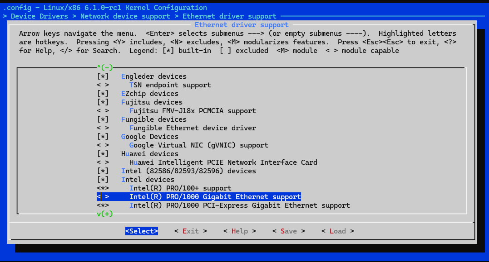
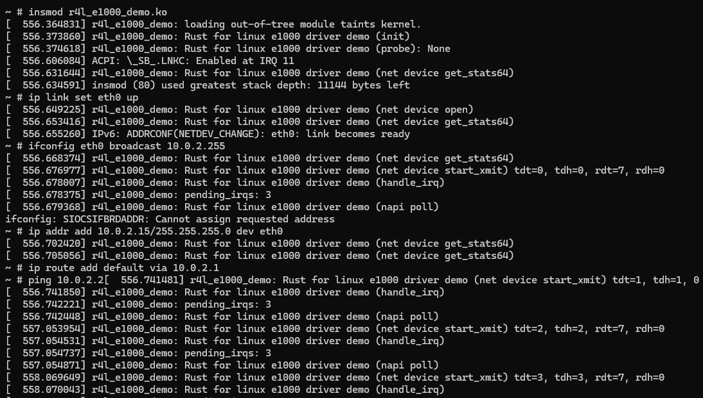

# Config Linux Network Driver with Rust
We use WSL2 with Ubuntu 22.04 to conduct all the assignment

## Questions & Answers

###  在该文件夹中调用make LLVM=1，该文件夹内的代码将编译成一个内核模块。请结合你学到的知识，回答以下两个问题：

Q1、编译成内核模块，是在哪个文件中以哪条语句定义的？
A1：In the file `Kbuild`, the code `obj-m := r4l_e1000_demo.o` defined it.

Q2、该模块位于独立的文件夹内，却能编译成Linux内核模块，这叫做out-of-tree module，请分析它是如何与内核代码产生联系的？
A2: In the `Makefile`, `KDIR ?= ../linux; $(MAKE) -C $(KDIR) M=$$PWD` commands will change to the directory of the kernel and point out the module by `M'$$PWD`.

## Step 1: Build Linux Bootable Image

```bash
cd src_e1000
bash build_image.sh
```

## Step 2: Turn Off the e1000 Network Driver
Back to `linux/` and re-run make LLVM=1 menuconfig, then:
```
Device Drivers --->
    [*] Network device support --->
        [*] Ethernet driver support --->
            <> Intel devices, Intel(R) PRO/1000 Gigabit Ethernet support
```


## Step 3: Modify Network Configuration

After recompile the kernal code and entering the QEMU virtual machine, conduct following commands:

```bash
insmod r4l_e1000_demo.ko
ip link set eth0 up
ifconfig eth0 broadcast 10.0.2.255
ip addr add 10.0.2.15/255.255.255.0 dev eth0 
ip route add default via 10.0.2.1
ping 10.0.2.2
```

The output of commands shows below:


## Step 4: Exit QEMU
Press `Ctrl-A X` to exit the QEMU.