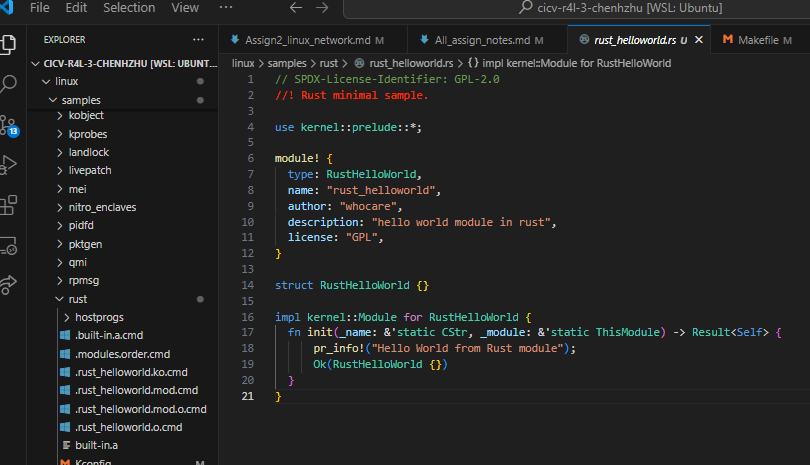

# Assign 3: Add Module to Linux with Rust
We use WSL2 with Ubuntu 22.04 to conduct all the assignment

## Step 1: Write Module Code
Create a file in `linux/samples/rust/` folder, named `rust_helloworld.rs`:
```rust
// SPDX-License-Identifier: GPL-2.0
//! Rust minimal sample.
      
use kernel::prelude::*;
      
module! {
  type: RustHelloWorld,
  name: "rust_helloworld",
  author: "whocare",
  description: "hello world module in rust",
  license: "GPL",
}
      
struct RustHelloWorld {}
      
impl kernel::Module for RustHelloWorld {
  fn init(_name: &'static CStr, _module: &'static ThisModule) -> Result<Self> {
      pr_info!("Hello World from Rust module\n");
      Ok(RustHelloWorld {})
  }
}

```


## Step 2: Modify Makefile and Kconfig
In `linux/sample/rust/Makefile`, add codes below:
```bash
obj-$(CONFIG_SAMPLE_RUST_HELLOWORLD)	+= rust_helloworld.o
```

In `linux/sample/rust/Kconfig`, add codes below:
```bash
config SAMPLE_RUST_HELLOWORLD
	tristate "Print Helloworld in Rust"
	help
	  This option builds the Rust module samples.

	  To compile this as a module, choose M here:
	  the module will be called rust_helloworld.

	  If unsure, say N.
```

## Step 3: Configure and Re-build the Kernel
Modify the configuration:
```
Kernel hacking
 [*] Sample kernel code  ---> 
     [*]   Rust samples  --->  
         <M>   HelloWorld 
```


## Step 4: Move Module to Target Folder
run follwoing code:
```bash
# Inside linux/ folder
mv ./samples/rust/rust_helloworld.ko ../src_e1000/rootfs
```

## Step 5: Run the Module
```bash
cd ../src_e1000
bash build_image.sh
```
Inside the QEMU:
```bash
insmod rust_helloworld.ko
dmesg | tail
```


